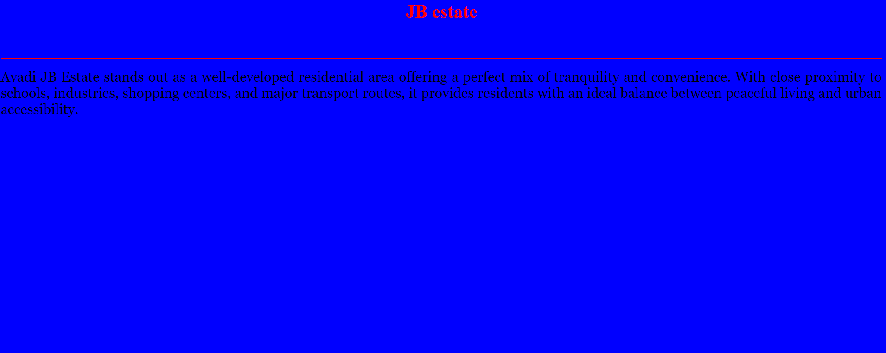
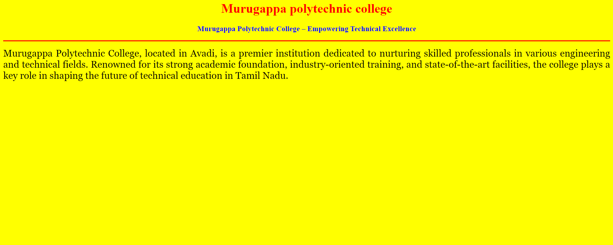
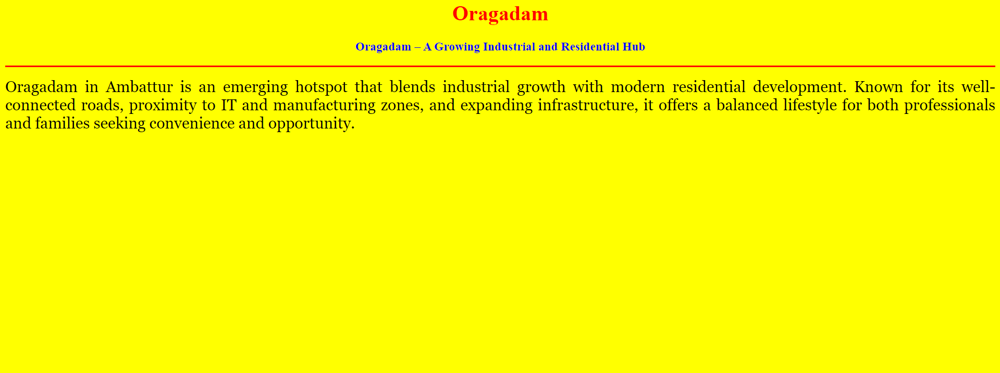
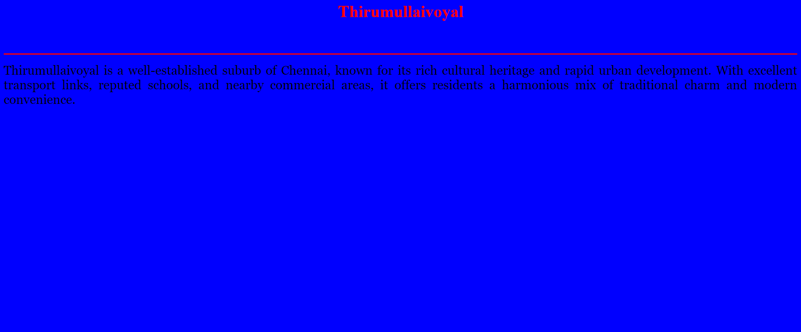

# Ex04 Places Around Me
## Date: 13-11-2025

## AIM
To develop a website to display details about the places around my house.

## DESIGN STEPS

### STEP 1
Create a Django admin interface.

### STEP 2
Download your city map from Google.

### STEP 3
Using ```<map>``` tag name the map.

### STEP 4
Create clickable regions in the image using ```<area>``` tag.

### STEP 5
Write HTML programs for all the regions identified.

### STEP 6
Execute the programs and publish them.

## CODE
map.html
```
<html>
    <head>
        <title>Velachery</title>
        <style>
            h1{
                font-family: Algerian;
                color: rgb(236, 112, 11);
                font-size: large;
                
            }
        </style>
    </head>
    <body>
        <h1 align="center">welcome to Velachery\nBhuvaneshwaran</h1>
        
        <center>
            
            
            <map name="mapnew">
                <area target="" alt="Thirumullaivoyal" title="Thirumullaivoyal" href="Thirumullaivoyal.html" coords="637,303,468,610" shape="rect">
                <area target="" alt="Murugappa polytechnic college" title="Murugappa polytechnic college" href="Murugappa polytechnic college.html" coords="637,303,169" shape="circle">
                <area target="" alt="Oragadam" title="Oragadam" href="Oragadam.html" coords="637,303,468,610" shape="rect">
                <area target="" alt="JB estate " title="JB estate" href="JB estate.html" coords="944,171,1443,258,637,303,468,610" shape="circle">
                

            
        
            </map> 
        </center> 
    </body>
</html>

```
JB estate.html
```
<html>
<head>
<title>My Home Town</title>
</head>
<body bgcolor="blue">
<h1 align="center">
<font color="red"><b>JB estate</b></font>
</h1>
<h3 align="center">
<font color="blue"><b>JB estate - A Serene Hub of Connectivity and Comfort</b></font>
</h3>
<hr size="3" color="red">
<p align="justify">
<font face="Georgia" size="5">
Avadi JB Estate stands out as a well-developed residential area offering a perfect mix of tranquility and convenience. With close proximity to schools, industries, shopping centers, and major transport routes, it provides residents with an ideal balance between peaceful living and urban accessibility.
</p>
</body>
</html>

```
Murugappa polytechnic college.html
```
<html>
<head>
<title>My Home Town</title>
</head>
<body bgcolor="yellow">
<h1 align="center">
<font color="red"><b>Murugappa polytechnic college</b></font>
</h1>
<h3 align="center">
<font color="blue"><b>Murugappa Polytechnic College – Empowering Technical Excellence</b></font>
</h3>
<hr size="3" color="red">
<p align="justify">
<font face="Georgia" size="5">
Murugappa Polytechnic College, located in Avadi, is a premier institution dedicated to nurturing skilled professionals in various engineering and technical fields. Renowned for its strong academic foundation, industry-oriented training, and state-of-the-art facilities, the college plays a key role in shaping the future of technical education in Tamil Nadu.</p>
</body>
</html>

```
Oragadam.html
```
<html>
<head>
<title>My Home Town</title>
</head>
<body bgcolor="yellow">
<h1 align="center">
<font color="red"><b>Oragadam</b></font>
</h1>
<h3 align="center">
<font color="blue"><b>Oragadam – A Growing Industrial and Residential Hub</b></font>
</h3>
<hr size="3" color="red">
<p align="justify">
<font face="Georgia" size="5">
Oragadam in Ambattur is an emerging hotspot that blends industrial growth with modern residential development. Known for its well-connected roads, proximity to IT and manufacturing zones, and expanding infrastructure, it offers a balanced lifestyle for both professionals and families seeking convenience and opportunity.
</p>
</body>
</html>

```
Thirumullaivoyal.html
```
<html>
<head>
<title>My Home Town</title>
</head>
<body bgcolor="blue">
<h1 align="center">
<font color="red"><b>Thirumullaivoyal</b></font>
</h1>
<h3 align="center">
<font color="blue"><b></b>Thirumullaivoyal - A Blend of Tradition and Urban Living</font>
</h3>
<hr size="3" color="red">
<p align="justify">
<font face="Georgia" size="5">
Thirumullaivoyal is a well-established suburb of Chennai, known for its rich cultural heritage and rapid urban development. With excellent transport links, reputed schools, and nearby commercial areas, it offers residents a harmonious mix of traditional charm and modern convenience.</p>
</body>
</html>

```


## OUTPUT






## RESULT
The program for implementing image maps using HTML is executed successfully.
